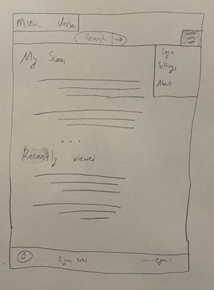
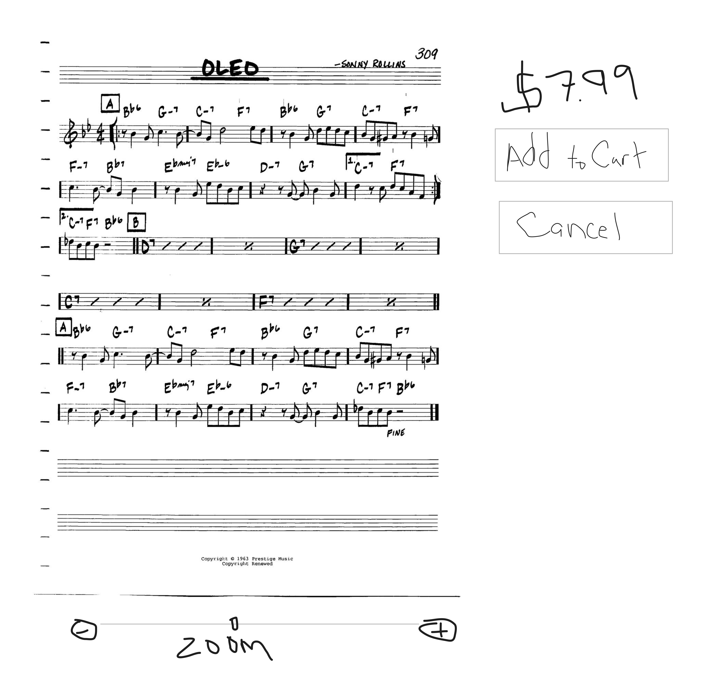
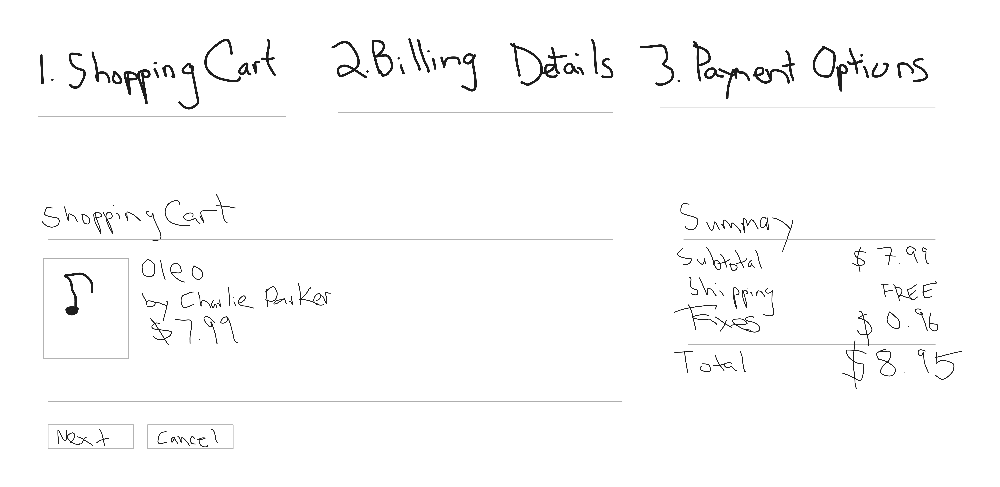
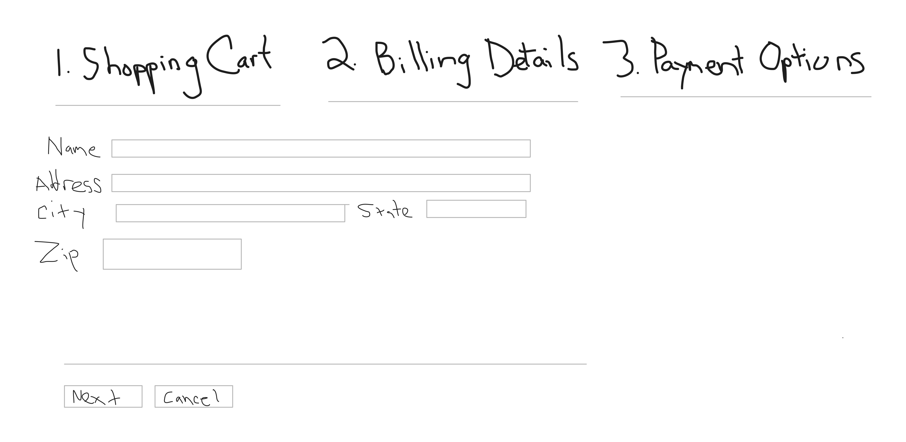
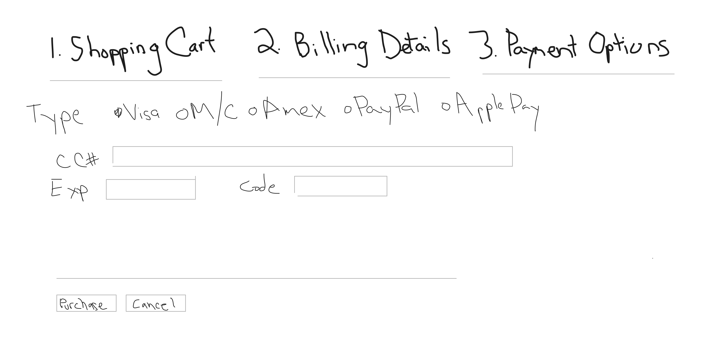
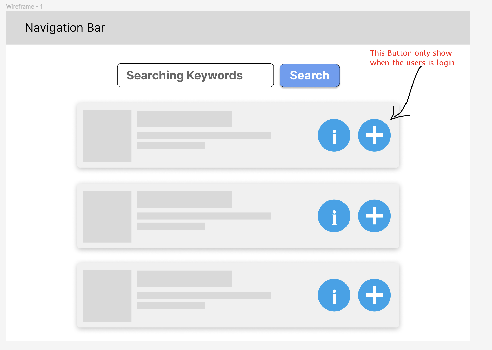

# Web Page Design
## MusicVerse by The Lightning Bolts
### CSPB 3308 Group 3

### Requirements for Milestone 4
+ Page Title
+ Page Description (include a mockup or hand drawn image of the page)
+ Parameters needed for the page
+ Data needed to render the page
+ Link destinations for the page
+ List of tests for verifying the rendering of the page

### Menu Page

 \
Description: This page would be the menu the user first sees when they open up the website. It would display a browse section with your scores and recently viewed tracks. It would also have the search bar up at the top and a pull down menu for loging in, setting, etc. At the bottom of the page it would have information about contact and terms of use.\
Parameters needed: search feature, a way to browse scores and recent items, drop down navigation, footer of page. \
Data needed: just some of the user information to show a section to browse of their scores or viewed items\
Link destinations: this would be just to the other pages using the drop down menu as well as the search feature to link to the results.\
List of tests: Does the formatting load with logos, color schemes, etc? Can someone scroll and browse different viewed items or items owned. Do the links go to different pages of the website? Can someone hover over the drop down menu to display the options?

### Score Product Page

Description: After visiting the browse or search pages, the user can click on an individual score to view it, check the price
and potentially add it to their cart. This page would need access to the folder holding the image previews for each score.
Parameters needed: Access to site menu, access to cart, list of recently viewed scores, price of currently loaded score
Link destination: main menu, cart, back
List of tests: This would include the preview image displaying properly and all text and buttons in the correct location.

### Shopping Cart

Description: The user can check the status of their cart and checkout if desired. The page would need access to 
thumbnail images of the user's selected scores. 
Parameters needed: items in cart, price of items in cart
Link destination: main menu, back
List of tests: This would include ensuring the score selected by the user is displayed in the cart.

### Billing Details

Description: Part 1 of the checkout process. The user must enter necessary billing info to complete a purchase. 
Parameters needed: items in cart, total price, name, address, city, state, zip, username/account info
Link destination: main menu, back to edit cart
List of tests: This would include ensuring all text and data fields are aligned.

### Confirmation Purchase

Description: The user must provide a payment for their order. 
Parameters needed: yes/no of purchase went thru, yes/no of authorization to download PDF of score
Link destination: main menu
List of tests: This would include checking the CC number given is in a valid format
and that all text and data fields are aligned. This page would take you back to the home page after purchase.

## Search results
+ Page Title: **search results**
+ Page Description (include a mockup or hand drawn image of the page):
    There is **a search box** on the top, which allow user to change their keywords to find the better result.
    Under the search box, there is a **list of search results**, which show the Title, brief description, the autor, publish data, rating(if applied), meta information, and buttons to view the detail page or add to the cart.
    
+ Parameters needed for the page: **Search Keyword, Login Status**
+ Data needed to render the page: **Search result list**
+ Link destinations for the page: **Score Product Page** for the searched scores.
+ List of tests for verifying the rendering of the page
    - Test if the "Add to Cart" Button hidden if there is no login information
    - Test if all correct result showing
    - Test not able to serach with no keywords
    - Test if the flask server can handle mutiple user searching jobs.
