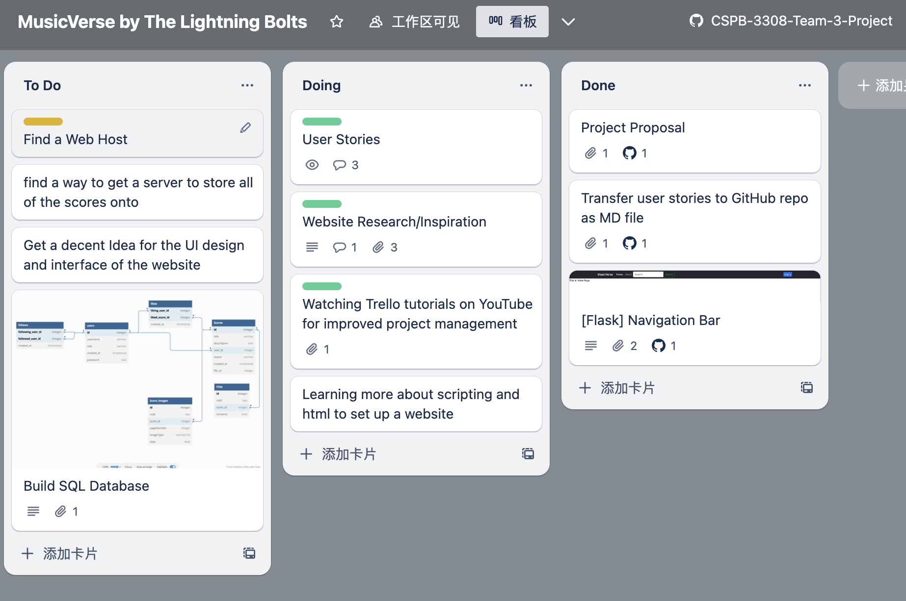
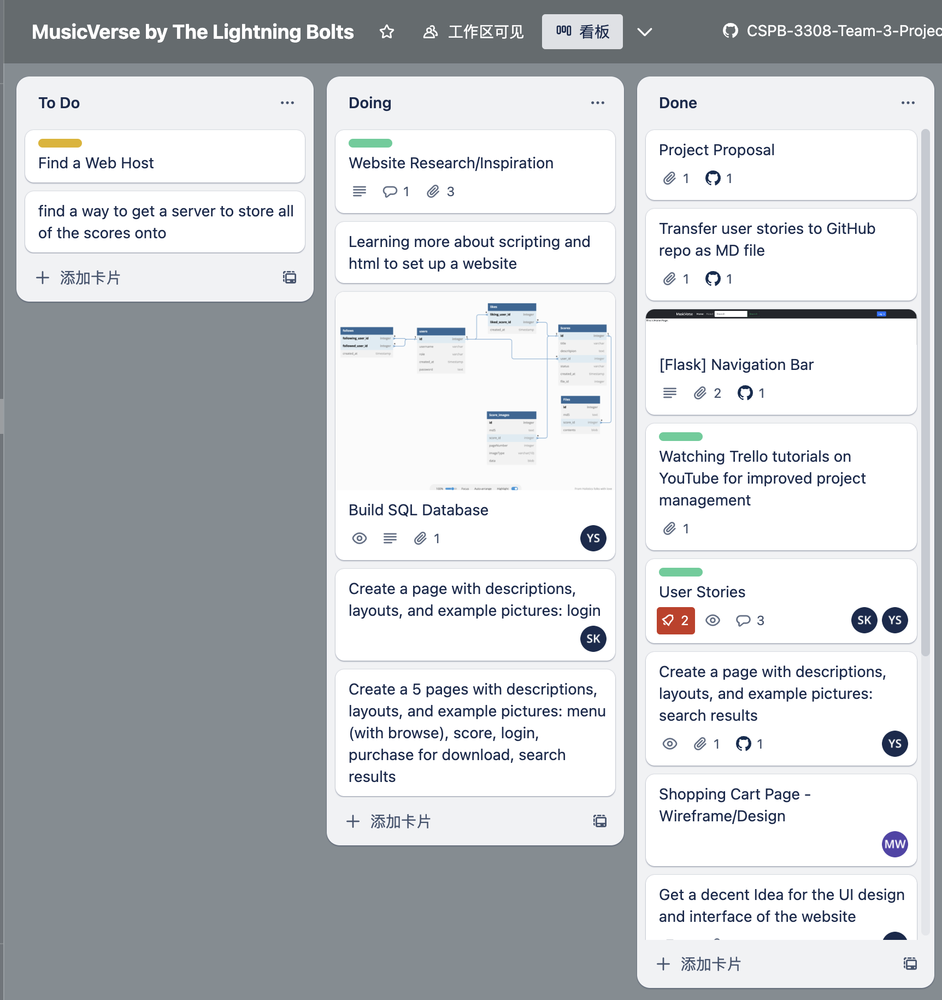
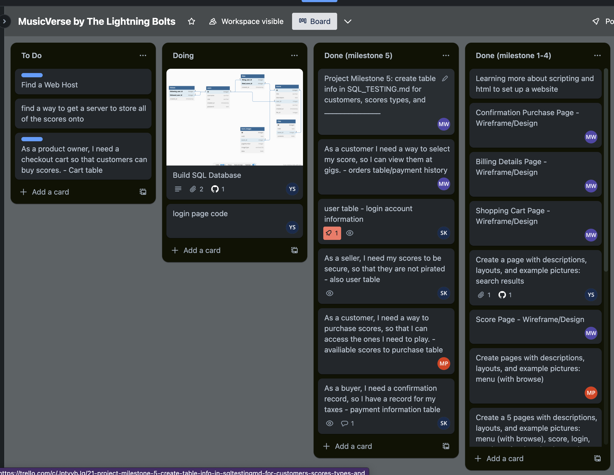

# Weely Status

## Week 4

Trello Screenshot:

This week we just focused a bit more on the user and what the persona of the user is going to be. We also looked around at other websites we'd like as inspiration. Also, for the coding side of things, we know have learned a lot more about how flask works to build a demo webpage.

### Sean Keery

- Created wireframes
- User stories entered into [Trello](https://trello.com/b/Oz0v3nr9/musicverse-by-the-lightning-bolts)
- Monday standup attendance [Zoom](https://Dell.zoom.us/j/9581483425?pwd=RUtyYVhQbXVpN1ZhT3BadzR0UWhRdz09)

### Mark Wilkening

- Setup Trello for group project
- Watched Trello tutorials for improved project management
- Monday standup attendance

- ### Max Panning

- looked at other music websites to find ideas
- Added a few user stories to trello
- Monday standup attendance

- ### Yuzhou Shen

- Work On SQL Database diagram
- Learning React
- Monday standup attendance

## Week 5&6
Trello Screenshot:

* Implement some htlm(navigation bar)
* Design the SQL Diagram

### Sean Keery

- Created login page for milestone 4
- User stories updated in [Trello](https://trello.com/b/Oz0v3nr9/musicverse-by-the-lightning-bolts)
- Monday standup attendance [Zoom](https://Dell.zoom.us/j/9581483425?pwd=RUtyYVhQbXVpN1ZhT3BadzR0UWhRdz09)

### Mark Wilkening

- Created wireframe page design for Shopping Cart, Billing Details, Confirmation Purchase, and Score Product Page.
- Monday standup attendance

  
### Max Panning

- Created menu page for milestone 4
- learned about how to use sql for the user data about their music sheets
- Monday standup attendance
  
### Yuzhou Shen
- Working On SQL CRUD module, (WORKING IN LOCAL BRANCH)
- Search Result Page Design
- Monday standup attendance

## Week 7
Trello Screenshot:

### Sean Keery

- Created user table for milestone 5
- Added user stories in [Trello](https://trello.com/b/Oz0v3nr9/musicverse-by-the-lightning-bolts)
- Trello screenshot uploaded and linked
- Weekly status added
- Monday standup attendance [Zoom](https://Dell.zoom.us/j/9581483425?pwd=RUtyYVhQbXVpN1ZhT3BadzR0UWhRdz09)

### Mark Wilkening

- Created 
- Monday standup attendance

  
### Max Panning

- created the scores table for milestone 5 and the respective test cases
- Monday standup attendance
  
### Yuzhou Shen
- Finish TEMPERARY User Part of SQL CRUD module(Support SQL, and PostreSQL), with Document on [Music Verse Modules Documentation](https://evnii.github.io/CSPB-3308-Team-3-Project/)
- Deploy Music Verse on [Music Verse](https://musicverse.onrender.com/)
- Deploy Music Verse API flask Server on [Music Verse API Swagger UI](https://musicverse-api.onrender.com/SwaggerUI/)
> The Render will will spin down the API server with inactivity. If not able to connect to API server, please refresh the page and wait a few scondes.
- Monday standup attendance

## Week 8
Trello Screenshot (*REPLACE*):

### Sean Keery

- Reviewed code submitted in [Pull Requests](https://github.com/EVNII/CSPB-3308-Team-3-Project/pulls?q=is%3Apr+is%3Aclosed)
- Added user stories in [Trello](https://trello.com/b/Oz0v3nr9/musicverse-by-the-lightning-bolts)
- Weekly status added
- Monday standup attendance [Zoom](https://Dell.zoom.us/j/9581483425?pwd=RUtyYVhQbXVpN1ZhT3BadzR0UWhRdz09)

### Mark Wilkening

- Read codebase provided by Yuzhou to prepare for coding of features
- Monday standup attendance

### Yuzhou Shen
- Implement Score Main Feature including:
  - Score APIs: `score/pdf/upload`, `score/all`, `score/<score_id>`, and `score/pdf/<score_id>`
  - Front end: user can view/download the PDFs once they loggin
- Monday standup attendance